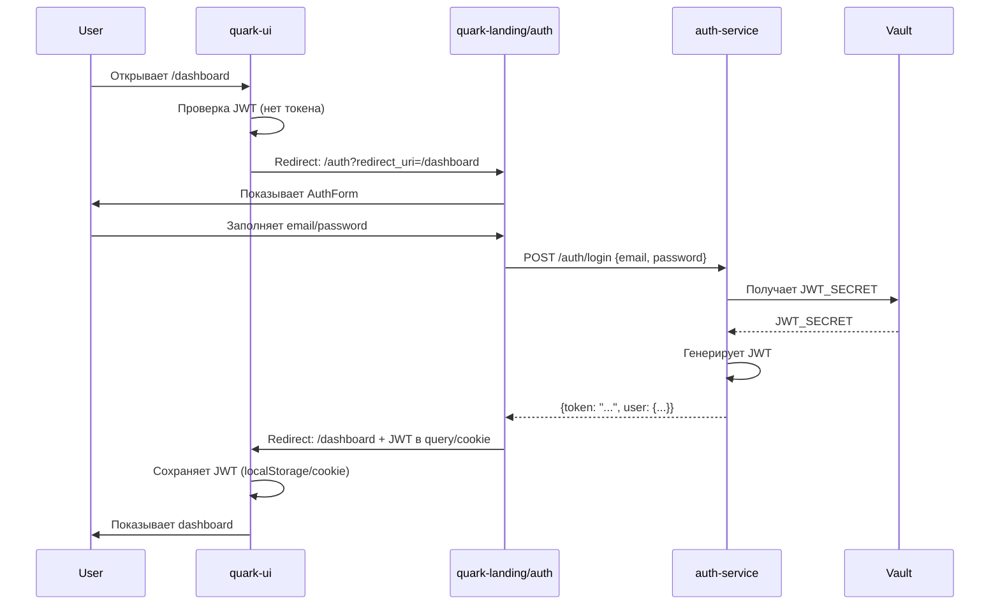

# ADR-009: Единая точка входа для авторизации (Unified Auth Entry Point)

**Статус**: Предложено  
**Дата**: 2024-11-03  
**Контекст**: Auth UI Integration (spec 001)  
**Декайдеры**: Chief Architect, Tech Lead, Security Team

---

## Контекст и проблема

Платформа Quark состоит из нескольких веб-интерфейсов:
- **quark-landing** — лендинг для новых пользователей
- **quark-ui** — единый интерфейс для блога, мессенджера и админ-панели
- **auth-service** — backend для авторизации с интеграцией Vault

**Текущее состояние**:
- В `quark-landing` реализован компонент `AuthForm` (email/password, режимы login/signup)
- В `quark-ui` есть заглушка для авторизации (только состояние `isAuthenticated` в store)
- Auth Service API существует, но **не подключён к UI**
- Vault интеграция готова для хранения JWT-секретов

**Проблемы**:
1. Нет интеграции между UI и Auth Service
2. Непонятно, где размещать форму авторизации (в каждом UI или централизованно)
3. Дублирование кода авторизации между интерфейсами
4. Будущее масштабирование: при появлении desktop/mobile мессенджера потребуется отдельный auth UI

**Вопрос**: Какую архитектуру выбрать для авторизации в веб-интерфейсах платформы?

---

## Рассмотренные варианты

### Вариант 1: Дублирование форм в каждом UI
```
quark-landing → своя AuthForm → Auth Service
quark-ui → своя AuthForm → Auth Service
```

**Плюсы**:
- Быстрая авторизация без редиректов
- Независимость интерфейсов

**Минусы**:
- Дублирование кода (валидация, стили, логика)
- Разный UX в разных интерфейсах
- Сложность поддержки при изменениях
- Не масштабируется на desktop/mobile

**Решение**: ❌ Отклонено (нарушает DRY, сложно поддерживать)

---

### Вариант 2: Shared NPM package (@quark/auth-ui)
```
@quark/auth-ui (React компонент)
    ├── используется в quark-landing
    └── используется в quark-ui
```

**Плюсы**:
- Переиспользование кода
- Единый UX
- Один источник правды

**Минусы**:
- Зависимость от React (не подходит для native mobile/desktop)
- Требует инфраструктуры для npm пакетов
- Version hell при breaking changes
- Не подходит для будущего standalone мессенджера

**Решение**: ❌ Отклонено (не масштабируется на non-web клиенты)

---

### Вариант 3: Единая точка входа в quark-landing ✅
```
quark-ui (неавторизован)
    ↓ redirect
quark-landing/auth?redirect_uri=/dashboard
    ↓ AuthForm
Auth Service → JWT
    ↓ redirect back
quark-ui (авторизован, JWT в cookie/localStorage)
```

**Плюсы**:
- ✅ **Единая точка авторизации** для всех клиентов (web/desktop/mobile)
- ✅ Централизованная безопасность (обновления в одном месте)
- ✅ Единый UX для всех пользователей
- ✅ **OAuth2-compliant** архитектура (стандарт индустрии)
- ✅ Масштабируется на desktop/mobile через WebView/browser
- ✅ Vault интегрируется только с auth-service (не с каждым UI)
- ✅ Подготовка к будущему standalone auth-ui при необходимости

**Минусы**:
- ⚠️ Дополнительный редирект (стандартная практика, как у Google/GitHub)
- ⚠️ Требует поддержки `redirect_uri` в Auth Service

**Решение**: ✅ **Принято**

---

## Решение

### Архитектура

**Единая точка входа**: `quark-landing/auth`

#### Flow авторизации:



#### Компоненты:

1. **quark-landing/auth**:
   - Содержит `AuthForm` компонент (login/signup режимы)
   - Принимает параметр `?redirect_uri=` (с whitelist проверкой)
   - После успешной авторизации → редирект обратно с JWT

2. **auth-service**:
   - Поддерживает `POST /auth/login`, `POST /auth/register`, `GET /auth/validate`
   - Принимает опциональный параметр `redirect_uri` (для возврата в исходное приложение)
   - Генерирует JWT с секретом из Vault
   - Возвращает `{token, user, expiresIn}`

3. **quark-ui**:
   - **Не содержит форм авторизации** (только редирект на landing)
   - Проверяет JWT при загрузке защищённых страниц
   - При отсутствии/невалидном токене → редирект на `quark-landing/auth?redirect_uri=<current_page>`
   - После получения токена → использует для всех API запросов

4. **Vault**:
   - Хранит `JWT_SECRET` для подписи токенов
   - Интегрируется только с `auth-service` (не с UI напрямую)

---

## Требования к реализации

### 1. Auth Service API

Должен поддерживать:

```
POST /auth/register
  Body: {email, username, password}
  Response: {token, user: {id, email, username}, expiresIn}

POST /auth/login
  Body: {email, password, rememberMe?}
  Response: {token, user: {id, email, username}, expiresIn}

GET /auth/validate
  Headers: {Authorization: "Bearer <token>"}
  Response: {valid: true, user: {...}} | {valid: false, error: "..."}

POST /auth/refresh
  Body: {refreshToken}
  Response: {token, expiresIn}
```

### 2. Redirect URI Whitelist

Auth Service должен проверять `redirect_uri` по whitelist:

```
Разрешённые домены:
- http://localhost:3000/* (quark-landing dev)
- http://localhost:3101/* (quark-ui dev)
- https://code4vibe.ru/*
- https://*.code4vibe.ru/*
```

### 3. JWT Storage

**Рекомендуемый подход**: httpOnly secure cookie (защита от XSS)

**Альтернативный подход** (для MVP): localStorage (проще реализовать, но менее безопасно)

**Структура JWT**:
```json
{
  "sub": "user_id",
  "email": "user@example.com",
  "username": "johndoe",
  "iat": 1699000000,
  "exp": 1699086400,
  "roles": ["user", "admin"]
}
```

### 4. Безопасность

- ✅ HTTPS only для production
- ✅ CSRF protection через `state` параметр
- ✅ XSS protection через httpOnly cookies (или Content-Security-Policy для localStorage)
- ✅ Rate limiting на `/auth/login` и `/auth/register`
- ✅ Password требования: минимум 8 символов, 1 цифра, 1 спецсимвол

---

## Миграционный путь (Будущее масштабирование)

### Этап 1 (MVP, сейчас): Единая точка входа в quark-landing
- ✅ Реализовать redirect flow
- ✅ Интегрировать Auth Service с Vault
- ✅ Подключить quark-ui через редирект

### Этап 2 (при появлении desktop/mobile мессенджера):
Выделить `auth-ui` как отдельный микрофронтенд:

```
auth.code4vibe.ru (или встроенный в quark-landing)
    ↓
Все клиенты редиректят сюда:
    ├── quark-ui (web)
    ├── quark-messenger-desktop (Electron/Tauri → WebView)
    └── quark-messenger-mobile (React Native → WebView)
```

**Преимущество**: Архитектура уже готова к этому переходу (redirect flow реализован)

---

## Последствия

### Положительные
- ✅ **Единая точка безопасности**: обновления авторизации в одном месте
- ✅ **Consistency**: одинаковый UX для всех пользователей
- ✅ **Масштабируемость**: легко добавить новые клиенты (desktop/mobile)
- ✅ **Industry standard**: OAuth2-like flow, понятный всем разработчикам
- ✅ **Vault integration**: централизованное управление секретами

### Отрицательные
- ⚠️ Дополнительный редирект (незначительная задержка ~200-500ms)
- ⚠️ Требуется реализация redirect flow в Auth Service
- ⚠️ Сложнее локальная разработка (нужны оба сервиса)

### Риски и митигация

| Риск | Митигация |
|------|-----------|
| Недоступность quark-landing блокирует авторизацию | High availability для landing (CDN, multiple replicas) |
| CSRF атаки через redirect_uri | Whitelist доменов, state/nonce параметры |
| XSS кража токенов из localStorage | Переход на httpOnly cookies в production |

---

## Связанные решения

- **ADR-005**: JWT Authentication — основа для токенов
- **ADR-003**: Universal Module Docking — интеграция с Plugin Hub
- **Constitution Article III**: Централизованное управление секретами через Vault

---

## Открытые вопросы

- [ ] **httpOnly cookie vs localStorage**: Финальное решение после security review
- [ ] **Refresh token strategy**: Как обновлять токены без повторного логина (отложено в v2)
- [ ] **Social OAuth** (Google, GitHub): Добавить в будущем? (out of scope для MVP)

---

## Альтернативы для будущего

Если потребуется:
- **Session-based auth** вместо JWT (для админ-панели)
- **Magic links** для passwordless auth (упрощённая регистрация)
- **2FA/MFA** через TOTP или SMS (повышенная безопасность)

---

**Автор**: AI Assistant + Chief Architect  
**Reviewers**: [Chief Architect], [Tech Lead], [Security Team]  
**Статус**: Ожидает утверждения → После утверждения обновить spec 001
