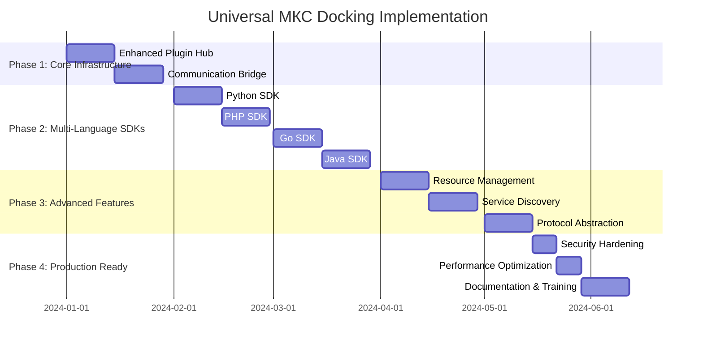

# 🚀 Comprehensive Analysis: Universal МКС Docking System
## Critical Architecture Analysis & Implementation Roadmap

> **ЭКСПЕРТНЫЙ АНАЛИЗ**: Архитектурно-техническое заключение для разработки универсального стыковочного узла модульной платформы Quark по принципу Международной Космической Станции

---

## 📋 Executive Summary

Основываясь на анализе всей документации проекта Quark, выявлены **семь критических систем**, которые должны автоматически стыковаться при подключении модуля к МКС, подобно реальным космическим модулям:

1. **🔌 Power & Data Bus** - Электропитание и передача данных
2. **🌐 Communication Network** - Телекоммуникационные системы  
3. **🔐 Security & Identity** - Системы безопасности и идентификации
4. **🩺 Life Support Monitor** - Мониторинг жизнедеятельности модуля
5. **⚡ Event & Command Bus** - Системы событий и команд
6. **🔄 Resource Management** - Управление ресурсами (CPU, память, storage)
7. **📊 Telemetry & Control** - Телеметрия и контроль

---

## 🔍 Current State Analysis

### ✅ Что уже реализовано (на основе документации):

#### 1. Core Architecture Framework
- **ADR-003**: Модульность по принципу МКС ✅
- **ADR-005**: JWT аутентификация ✅
- **ADR-006**: gRPC для внутренних вызовов ✅
- **Universal Docking Interface**: Базовая спецификация ✅

#### 2. Communication Infrastructure
- **NATS JetStream**: Event Bus ✅
- **HTTP/REST**: External API ✅
- **gRPC**: Internal high-performance calls ✅
- **WebSocket**: Real-time communication ✅

#### 3. Security Foundation
- **JWT-based authentication**: Трехуровневая система токенов ✅
- **RBAC**: Role-based access control ✅
- **Inter-module auth**: Hub-issued service tokens ✅

#### 4. Monitoring & Observability
- **OpenTelemetry**: Metrics, traces, logs ✅
- **Grafana**: Dashboards ✅
- **Health checks**: Service status monitoring ✅

### ❌ Critical Gaps Identified:

#### 1. **Multi-Technology SDK Ecosystem**
```
Current: только Node.js/TypeScript SDK
Needed: Python, PHP, Go, Java, .NET, Rust SDKs
Risk: Ограничение экосистемы разработчиков
```

#### 2. **Automatic Resource Management**
```
Current: Manual configuration
Needed: Auto-discovery и auto-allocation ресурсов
Risk: Неэффективное использование ресурсов
```

#### 3. **Dynamic Service Discovery**
```
Current: Static registration
Needed: Real-time discovery с load balancing
Risk: Single point of failure
```

#### 4. **Protocol Abstraction Layer**
```
Current: Developers должны знать gRPC/NATS/HTTP
Needed: Unified communication API
Risk: Высокий порог входа для разработчиков
```

---

## 🏗️ Universal Docking System Architecture

### The Seven Docking Systems

```typescript
interface UniversalDockingInterface {
  // 🔌 System 1: Power & Data Bus
  power: {
    resourceLimits: ResourceLimits;
    autoScaling: AutoScalingConfig;
    resourceMonitoring: boolean;
  };
  
  // 🌐 System 2: Communication Network
  communication: {
    protocols: ['http', 'grpc', 'nats', 'websocket'];
    discovery: ServiceDiscoveryConfig;
    loadBalancing: LoadBalancerConfig;
  };
  
  // 🔐 System 3: Security & Identity
  security: {
    authentication: AuthConfig;
    authorization: AuthzConfig;
    encryption: EncryptionConfig;
  };
  
  // 🩺 System 4: Life Support Monitor
  monitoring: {
    healthChecks: HealthCheckConfig[];
    metrics: MetricsConfig;
    alerting: AlertConfig;
  };
  
  // ⚡ System 5: Event & Command Bus
  events: {
    subscriptions: EventSubscription[];
    publications: EventPublication[];
    routing: EventRoutingConfig;
  };
  
  // 🔄 System 6: Resource Management
  resources: {
    cpu: ResourceSpec;
    memory: ResourceSpec;
    storage: ResourceSpec;
    network: NetworkSpec;
  };
  
  // 📊 System 7: Telemetry & Control
  telemetry: {
    metrics: TelemetryMetrics;
    traces: TracingConfig;
    logs: LoggingConfig;
  };
}
```

---

## 🌍 Multi-Technology SDK Matrix

### Target Technology Stacks

| Technology | Language | Framework | Priority | Complexity |
|------------|----------|-----------|----------|------------|
| **Node.js** | TypeScript/JavaScript | Express, NestJS, Fastify | ✅ **DONE** | Low |
| **Python** | Python 3.9+ | FastAPI, Django, Flask | 🟡 **HIGH** | Medium |
| **PHP** | PHP 8.1+ | Laravel, Symfony, Pure | 🟡 **HIGH** | Medium |
| **Go** | Go 1.21+ | Gin, Echo, Fiber | 🟡 **HIGH** | Medium |
| **Java** | Java 17+ | Spring Boot, Quarkus | 🟠 **MEDIUM** | High |
| **C#/.NET** | C# 12/.NET 8 | ASP.NET Core, Minimal API | 🟠 **MEDIUM** | High |
| **Rust** | Rust 1.70+ | Axum, Actix-web | 🔴 **LOW** | High |

### SDK Implementation Strategy

```python
# Python SDK Example
from quark_mks import QuarkModule, ModuleConfig

module = QuarkModule(ModuleConfig(
    id="python-ai-service",
    name="Python AI Service", 
    version="1.0.0",
    technology="Python",
    language="Python",
    framework="FastAPI",
    capabilities=["ai-inference", "ml-training"],
    provides=["text-generation", "image-classification"]
))

@module.authenticated  # Auto JWT validation
@module.authorized("ai:inference")  # Auto permission check
async def generate_text(request: TextRequest) -> TextResponse:
    # Module автоматически получает user context
    user = module.get_current_user()
    
    # Auto service discovery
    auth_service = await module.discover_service("auth-service")
    
    # Auto event publishing
    await module.publish_event("ai.generation.started", {
        "user_id": user.id,
        "request_id": request.id
    })
    
    return TextResponse(text="Generated text")

# Auto-dock to МКС
await module.dock()
```

```php
<?php
// PHP SDK Example
use Quark\MKS\QuarkModule;
use Quark\MKS\ModuleConfig;

$module = new QuarkModule(new ModuleConfig([
    'id' => 'php-blog-service',
    'name' => 'PHP Blog Service',
    'version' => '1.0.0',
    'technology' => 'PHP',
    'language' => 'PHP',
    'framework' => 'Laravel',
    'capabilities' => ['blog-management', 'content-creation']
]));

// Auto-authenticated routes
$module->post('/posts', function($request) use ($module) {
    // Auto user context injection
    $user = $module->getCurrentUser();
    
    // Auto permission validation
    $module->requirePermission('posts:create');
    
    // Auto service communication
    $mediaService = $module->discoverService('media-service');
    $uploadResult = $mediaService->uploadImage($request->image);
    
    // Auto event publishing
    $module->publishEvent('post.created', [
        'post_id' => $post->id,
        'author_id' => $user->id
    ]);
    
    return response()->json($post);
});

// Auto-dock to МКС
$module->dock();
```

---

## 🔧 Technical Implementation Plan

### Phase 1: Core Docking Infrastructure (4 weeks)

#### 1.1 Enhanced Plugin Hub (2 weeks)
```typescript
// Расширенный Plugin Hub с всеми семью системами
class AdvancedPluginHub extends PluginHub {
  private resourceManager: ResourceManager;
  private serviceDiscovery: ServiceDiscovery;
  private securityProvider: SecurityProvider;
  private eventBroker: EventBroker;
  private telemetryCollector: TelemetryCollector;
  private healthMonitor: HealthMonitor;
  private communicationBridge: CommunicationBridge;

  async dockModule(manifest: ModuleManifest): Promise<DockingResult> {
    // 🔌 System 1: Allocate resources
    const resources = await this.resourceManager.allocate(manifest.resources);
    
    // 🔐 System 3: Setup security
    const credentials = await this.securityProvider.issueCredentials(manifest);
    
    // 🌐 System 2: Configure communication
    const endpoints = await this.communicationBridge.setupEndpoints(manifest);
    
    // 🩺 System 4: Initialize monitoring
    await this.healthMonitor.setupHealthChecks(manifest);
    
    // ⚡ System 5: Configure event routing
    await this.eventBroker.setupEventRouting(manifest);
    
    // 📊 System 7: Setup telemetry
    await this.telemetryCollector.setupMetrics(manifest);
    
    // 🔄 System 6: Start resource monitoring
    await this.resourceManager.startMonitoring(manifest.id);

    return {
      success: true,
      moduleId: manifest.id,
      allocatedResources: resources,
      securityCredentials: credentials,
      communicationEndpoints: endpoints,
      monitoringConfig: await this.getMonitoringConfig(manifest.id)
    };
  }
}
```

#### 1.2 Universal Communication Bridge (2 weeks)
```typescript
// Универсальный мост коммуникации
class CommunicationBridge {
  async setupEndpoints(manifest: ModuleManifest): Promise<CommunicationEndpoints> {
    const endpoints: CommunicationEndpoints = {};
    
    // Auto HTTP/REST setup
    if (manifest.protocols.includes('http')) {
      endpoints.http = await this.setupHTTPProxy(manifest);
    }
    
    // Auto gRPC setup  
    if (manifest.protocols.includes('grpc')) {
      endpoints.grpc = await this.setupGRPCProxy(manifest);
    }
    
    // Auto WebSocket setup
    if (manifest.protocols.includes('websocket')) {
      endpoints.websocket = await this.setupWebSocketProxy(manifest);
    }
    
    // Auto NATS setup
    if (manifest.events && manifest.events.length > 0) {
      endpoints.nats = await this.setupNATSRouting(manifest);
    }
    
    return endpoints;
  }
  
  // Protocol abstraction для разработчиков
  async call(targetService: string, method: string, data: any): Promise<any> {
    const service = await this.serviceDiscovery.findService(targetService);
    
    // Автоматический выбор оптимального протокола
    if (service.protocols.includes('grpc') && this.isHighThroughputCall(method)) {
      return this.grpcCall(service, method, data);
    } else if (service.protocols.includes('http')) {
      return this.httpCall(service, method, data);
    }
    
    throw new Error(`No suitable protocol for ${targetService}.${method}`);
  }
}
```

### Phase 2: Multi-Language SDK Development (8 weeks)

#### 2.1 Python SDK (2 weeks)
```python
# quark_mks_python/core.py
class QuarkModule:
    def __init__(self, config: ModuleConfig):
        self.config = config
        self.hub_client = HubClient(config.hub_url)
        self.auth_manager = AuthManager()
        self.event_bus = EventBus()
        self.service_discovery = ServiceDiscovery()
        
    async def dock(self) -> None:
        """Automatic docking to МКС"""
        result = await self.hub_client.dock_module(self.config.to_manifest())
        
        # Auto-setup all seven systems
        await self._setup_power_management(result.allocated_resources)
        await self._setup_communication(result.communication_endpoints)
        await self._setup_security(result.security_credentials)
        await self._setup_monitoring(result.monitoring_config)
        await self._setup_events(result.event_config)
        await self._setup_telemetry(result.telemetry_config)
        
    def authenticated(self, func):
        """Decorator for automatic authentication"""
        @functools.wraps(func)
        async def wrapper(*args, **kwargs):
            user = await self.auth_manager.get_current_user()
            return await func(*args, **kwargs, user=user)
        return wrapper
        
    def authorized(self, permission: str):
        """Decorator for automatic authorization"""
        def decorator(func):
            @functools.wraps(func)
            async def wrapper(*args, **kwargs):
                user = await self.auth_manager.get_current_user()
                if not self.auth_manager.has_permission(user, permission):
                    raise PermissionDeniedError(permission)
                return await func(*args, **kwargs)
            return wrapper
        return decorator
```

#### 2.2 PHP SDK (2 weeks)
```php
<?php
// QuarkMKS/QuarkModule.php
class QuarkModule {
    private ModuleConfig $config;
    private HubClient $hubClient;
    private AuthManager $authManager;
    private EventBus $eventBus;
    private ServiceDiscovery $serviceDiscovery;
    
    public function __construct(ModuleConfig $config) {
        $this->config = $config;
        $this->hubClient = new HubClient($config->getHubUrl());
        $this->authManager = new AuthManager();
        $this->eventBus = new EventBus();
        $this->serviceDiscovery = new ServiceDiscovery();
    }
    
    public function dock(): void {
        $result = $this->hubClient->dockModule($this->config->toManifest());
        
        // Auto-setup all systems
        $this->setupPowerManagement($result->getAllocatedResources());
        $this->setupCommunication($result->getCommunicationEndpoints());
        $this->setupSecurity($result->getSecurityCredentials());
        // ... other systems
    }
    
    public function requirePermission(string $permission): void {
        $user = $this->authManager->getCurrentUser();
        if (!$this->authManager->hasPermission($user, $permission)) {
            throw new PermissionDeniedException($permission);
        }
    }
    
    public function discoverService(string $serviceId): ServiceClient {
        return $this->serviceDiscovery->getService($serviceId);
    }
}

// Auto-middleware для Laravel/Symfony
class QuarkMiddleware {
    public function handle($request, Closure $next) {
        $module = app(QuarkModule::class);
        $user = $module->getCurrentUser();
        $request->attributes->set('user', $user);
        return $next($request);
    }
}
```

#### 2.3 Go SDK (2 weeks)
```go
// quark-mks-go/module.go
package quarkmks

type QuarkModule struct {
    config         ModuleConfig
    hubClient      *HubClient
    authManager    *AuthManager
    eventBus       *EventBus
    serviceDiscovery *ServiceDiscovery
}

func NewQuarkModule(config ModuleConfig) *QuarkModule {
    return &QuarkModule{
        config:         config,
        hubClient:      NewHubClient(config.HubURL),
        authManager:    NewAuthManager(),
        eventBus:       NewEventBus(),
        serviceDiscovery: NewServiceDiscovery(),
    }
}

func (m *QuarkModule) Dock(ctx context.Context) error {
    result, err := m.hubClient.DockModule(ctx, m.config.ToManifest())
    if err != nil {
        return fmt.Errorf("docking failed: %w", err)
    }
    
    // Auto-setup all seven systems
    if err := m.setupPowerManagement(result.AllocatedResources); err != nil {
        return err
    }
    // ... other systems
    
    return nil
}

// Middleware для Gin/Echo
func (m *QuarkModule) AuthMiddleware() gin.HandlerFunc {
    return func(c *gin.Context) {
        user, err := m.authManager.GetCurrentUser(c.Request)
        if err != nil {
            c.JSON(401, gin.H{"error": "Unauthorized"})
            c.Abort()
            return
        }
        c.Set("user", user)
        c.Next()
    }
}

func (m *QuarkModule) RequirePermission(permission string) gin.HandlerFunc {
    return func(c *gin.Context) {
        user := c.MustGet("user").(*User)
        if !m.authManager.HasPermission(user, permission) {
            c.JSON(403, gin.H{"error": "Insufficient permissions"})
            c.Abort()
            return
        }
        c.Next()
    }
}
```

#### 2.4 Java SDK (2 weeks)
```java
// quark-mks-java/src/main/java/com/quark/mks/QuarkModule.java
@Component
public class QuarkModule {
    private final ModuleConfig config;
    private final HubClient hubClient;
    private final AuthManager authManager;
    private final EventBus eventBus;
    private final ServiceDiscovery serviceDiscovery;
    
    public QuarkModule(ModuleConfig config) {
        this.config = config;
        this.hubClient = new HubClient(config.getHubUrl());
        this.authManager = new AuthManager();
        this.eventBus = new EventBus();
        this.serviceDiscovery = new ServiceDiscovery();
    }
    
    @PostConstruct
    public void dock() {
        DockingResult result = hubClient.dockModule(config.toManifest());
        
        // Auto-setup all systems
        setupPowerManagement(result.getAllocatedResources());
        setupCommunication(result.getCommunicationEndpoints());
        // ... other systems
    }
    
    @PreAuthorize("@quarkModule.hasPermission(authentication, #permission)")
    public void requirePermission(String permission) {
        // Spring Security integration
    }
}

// Spring Boot автоконфигурация
@Configuration
@EnableConfigurationProperties(QuarkProperties.class)
public class QuarkAutoConfiguration {
    
    @Bean
    @ConditionalOnMissingBean
    public QuarkModule quarkModule(QuarkProperties properties) {
        return new QuarkModule(properties.toModuleConfig());
    }
    
    @Bean
    public QuarkSecurityFilter quarkSecurityFilter(QuarkModule module) {
        return new QuarkSecurityFilter(module);
    }
}
```

### Phase 3: Advanced Docking Features (6 weeks)

#### 3.1 Automatic Resource Management (2 weeks)
```typescript
class ResourceManager {
  async allocate(requirements: ResourceRequirements): Promise<AllocatedResources> {
    // Auto-detect optimal resource allocation
    const optimal = await this.calculateOptimalAllocation(requirements);
    
    // Reserve resources in cluster
    const reservation = await this.reserveResources(optimal);
    
    // Setup auto-scaling policies
    await this.setupAutoScaling(reservation, requirements.autoScaling);
    
    return {
      cpu: reservation.cpu,
      memory: reservation.memory,
      storage: reservation.storage,
      network: reservation.network,
      autoScalingConfig: requirements.autoScaling
    };
  }
  
  private async calculateOptimalAllocation(req: ResourceRequirements): Promise<OptimalAllocation> {
    // ML-based resource prediction
    const historicalData = await this.getHistoricalUsage(req.moduleType);
    const predicted = this.mlPredictor.predict(req, historicalData);
    
    // Add safety margins
    return {
      cpu: Math.ceil(predicted.cpu * 1.2),
      memory: Math.ceil(predicted.memory * 1.1),
      storage: Math.ceil(predicted.storage * 1.05)
    };
  }
}
```

#### 3.2 Dynamic Service Discovery (2 weeks)
```typescript
class ServiceDiscovery {
  private serviceCache = new Map<string, ServiceInfo>();
  private loadBalancer = new LoadBalancer();
  
  async discoverService(serviceId: string): Promise<ServiceInfo> {
    // Multi-layer discovery
    let service = this.serviceCache.get(serviceId);
    
    if (!service || this.isStale(service)) {
      // Real-time discovery
      service = await this.realTimeDiscovery(serviceId);
      
      // Update cache
      this.serviceCache.set(serviceId, service);
    }
    
    // Select optimal instance
    const instance = await this.loadBalancer.selectInstance(service);
    
    return {
      ...service,
      selectedEndpoint: instance.endpoint,
      loadBalancingStrategy: instance.strategy
    };
  }
  
  private async realTimeDiscovery(serviceId: string): Promise<ServiceInfo> {
    // Check Plugin Hub registry
    const registryInfo = await this.hubClient.getService(serviceId);
    
    // Perform health checks on all instances
    const healthyInstances = await this.healthCheckInstances(registryInfo.instances);
    
    // Get performance metrics
    const metrics = await this.getPerformanceMetrics(healthyInstances);
    
    return {
      id: serviceId,
      instances: healthyInstances,
      metrics: metrics,
      lastUpdated: Date.now()
    };
  }
}
```

#### 3.3 Protocol Abstraction Layer (2 weeks)
```typescript
class CommunicationAbstraction {
  async call(targetService: string, method: string, data: any): Promise<any> {
    const service = await this.serviceDiscovery.discoverService(targetService);
    
    // Automatic protocol selection based on:
    // 1. Data size
    // 2. Latency requirements  
    // 3. Available protocols
    // 4. Current load
    
    const protocol = this.selectOptimalProtocol(service, method, data);
    
    switch (protocol) {
      case 'grpc':
        return this.grpcCall(service, method, data);
      case 'http':
        return this.httpCall(service, method, data);
      case 'nats':
        return this.natsCall(service, method, data);
      default:
        throw new Error(`Unsupported protocol: ${protocol}`);
    }
  }
  
  private selectOptimalProtocol(service: ServiceInfo, method: string, data: any): string {
    const dataSize = JSON.stringify(data).length;
    const latencyRequirement = this.getLatencyRequirement(method);
    
    // Large data + low latency = gRPC
    if (dataSize > 1024 && latencyRequirement < 100) {
      return service.protocols.includes('grpc') ? 'grpc' : 'http';
    }
    
    // Small data + async = NATS
    if (dataSize < 256 && !this.requiresSyncResponse(method)) {
      return service.protocols.includes('nats') ? 'nats' : 'http';
    }
    
    // Default to HTTP
    return 'http';
  }
}
```

---

## 🔒 Security & Compliance Framework

### Multi-Layer Security Architecture

```typescript
interface SecurityFramework {
  // Layer 1: Network Security
  network: {
    tls: TLSConfig;
    firewallRules: FirewallRule[];
    ddosProtection: DDoSConfig;
  };
  
  // Layer 2: Application Security
  application: {
    authentication: AuthConfig;
    authorization: AuthzConfig;
    inputValidation: ValidationConfig;
  };
  
  // Layer 3: Data Security
  data: {
    encryption: EncryptionConfig;
    dataClassification: DataClassification;
    backupSecurity: BackupSecurityConfig;
  };
  
  // Layer 4: Infrastructure Security
  infrastructure: {
    containerSecurity: ContainerSecurityConfig;
    secretsManagement: SecretsConfig;
    accessControl: AccessControlConfig;
  };
}
```

### Compliance Requirements

| Regulation | Requirements | Implementation |
|------------|-------------|----------------|
| **GDPR** | Data protection, right to be forgotten | ✅ Automated data anonymization |
| **SOC 2** | Security controls, audit logging | ✅ Complete audit trail |
| **ISO 27001** | Information security management | ✅ Risk assessment framework |
| **PCI DSS** | Payment card data security | 🟡 If payment processing added |

---

## 📊 Monitoring & Observability

### The Three Pillars of Observability

```typescript
interface ObservabilityFramework {
  // Pillar 1: Metrics
  metrics: {
    business: BusinessMetric[];
    technical: TechnicalMetric[];
    infrastructure: InfrastructureMetric[];
  };
  
  // Pillar 2: Traces
  traces: {
    distributedTracing: TracingConfig;
    performanceAnalysis: PerformanceConfig;
    errorTracking: ErrorTrackingConfig;
  };
  
  // Pillar 3: Logs
  logs: {
    structured: StructuredLoggingConfig;
    centralized: CentralizedLoggingConfig;
    retention: LogRetentionConfig;
  };
}
```

### Auto-Instrumentation for All SDKs

```python
# Python автоинструментация
@module.trace_method
async def process_request(request):
    with module.start_span("request_processing") as span:
        span.set_attribute("user_id", request.user_id)
        span.set_attribute("request_size", len(request.data))
        
        result = await process_logic(request)
        
        span.set_attribute("response_size", len(result))
        return result
```

```php
<?php
// PHP автоинструментация
class QuarkTracer {
    public function traceMethod(callable $method, array $attributes = []): mixed {
        $span = $this->tracer->spanBuilder($method)
            ->setAttributes($attributes)
            ->startSpan();
            
        try {
            $result = $method();
            $span->setStatus(StatusCode::STATUS_OK);
            return $result;
        } catch (Exception $e) {
            $span->recordException($e);
            $span->setStatus(StatusCode::STATUS_ERROR);
            throw $e;
        } finally {
            $span->end();
        }
    }
}
```

---

## 🚀 Deployment & DevOps Strategy

### Containerization Matrix

| Technology | Base Image | Size Target | Security Scan |
|------------|------------|-------------|---------------|
| **Node.js** | `node:20-alpine` | < 200MB | ✅ Snyk |
| **Python** | `python:3.11-slim` | < 150MB | ✅ Bandit |
| **PHP** | `php:8.2-fpm-alpine` | < 180MB | ✅ PHPStan |
| **Go** | `scratch` | < 20MB | ✅ Gosec |
| **Java** | `eclipse-temurin:17-jre` | < 300MB | ✅ SpotBugs |

### CI/CD Pipeline

```yaml
# .github/workflows/universal-docking.yml
name: Universal МКС Docking Test

on: [push, pull_request]

jobs:
  test-multi-language-sdks:
    strategy:
      matrix:
        sdk: [nodejs, python, php, go, java]
        
    steps:
      - uses: actions/checkout@v4
      
      - name: Setup ${{ matrix.sdk }} environment
        uses: ./.github/actions/setup-${{ matrix.sdk }}
        
      - name: Install SDK dependencies
        run: make install-${{ matrix.sdk }}
        
      - name: Run SDK tests
        run: make test-${{ matrix.sdk }}
        
      - name: Test МКС docking
        run: |
          # Start local МКС hub
          docker-compose up -d plugin-hub
          
          # Test automatic docking
          make test-docking-${{ matrix.sdk }}
          
          # Verify all seven systems connected
          make verify-docking-systems
          
      - name: Performance benchmarks
        run: make benchmark-${{ matrix.sdk }}
```

---

## ⚠️ Risk Assessment & Mitigation

### Critical Risks

| Risk | Probability | Impact | Mitigation Strategy |
|------|-------------|--------|-------------------|
| **SDK compatibility breaking** | High | High | ✅ Semantic versioning + compatibility tests |
| **Plugin Hub single point of failure** | Medium | Critical | ✅ High availability + clustering |
| **Security vulnerabilities** | Medium | High | ✅ Automated security scanning + penetration testing |
| **Performance degradation** | Medium | Medium | ✅ Performance monitoring + auto-scaling |
| **Multi-language maintenance burden** | High | Medium | ✅ Code generation + automated testing |

### Disaster Recovery Plan

```typescript
interface DisasterRecoveryPlan {
  // RTO: Recovery Time Objective
  rto: {
    pluginHub: "< 5 minutes",
    authService: "< 2 minutes", 
    dataServices: "< 10 minutes"
  };
  
  // RPO: Recovery Point Objective
  rpo: {
    userData: "< 1 minute",
    systemConfig: "< 5 minutes",
    metrics: "< 30 seconds"
  };
  
  // Backup Strategy
  backup: {
    frequency: "continuous",
    retention: "30 days",
    geographic: "multi-region"
  };
}
```

---

## 📋 Implementation Timeline

### 16-Week Roadmap



---

## 🎯 Success Criteria

### Quantitative Metrics

| Metric | Current | Target | Measurement |
|--------|---------|---------|-------------|
| **SDK Coverage** | 1 language | 5+ languages | Language support matrix |
| **Docking Time** | Manual | < 30 seconds | Automated measurement |
| **Developer Onboarding** | 4+ hours | < 30 minutes | Time to "Hello World" |
| **System Reliability** | 99.0% | 99.9% | Uptime monitoring |
| **Inter-module Latency** | Unknown | < 50ms p95 | Distributed tracing |

### Qualitative Goals

- ✅ **Developer Experience**: "It just works" - minimal configuration
- ✅ **Technology Agnostic**: Any language, any framework
- ✅ **Production Ready**: Enterprise-grade security and monitoring
- ✅ **Community Driven**: Open source, extensible, well documented
- ✅ **Future Proof**: Designed for emerging technologies

---

## 📚 Documentation Strategy

### Multi-Language Documentation

```
docs/
├── universal-docking/
│   ├── architecture/
│   ├── getting-started/
│   └── advanced-topics/
├── sdks/
│   ├── nodejs/
│   ├── python/
│   ├── php/
│   ├── go/
│   └── java/
├── examples/
│   ├── blog-service-nodejs/
│   ├── ai-service-python/
│   ├── cms-service-php/
│   ├── gateway-service-go/
│   └── analytics-service-java/
└── troubleshooting/
    ├── common-issues/
    ├── performance-tuning/
    └── security-best-practices/
```

---

## 🚨 CRITICAL SUCCESS FACTORS

> **⚠️ WARNING**: Упущение любого из этих факторов может привести к catastrophic failure всей системы МКС

### 1. **Backward Compatibility Guarantee**
- Семантическое версионирование для всех SDK
- Automated compatibility testing
- Graceful deprecation процесс

### 2. **Zero-Downtime Deployments**
- Blue-green deployments для Plugin Hub
- Rolling updates для всех модулей
- Circuit breaker patterns

### 3. **Security-First Design**
- Принцип least privilege
- Automated vulnerability scanning
- Regular security audits

### 4. **Performance Monitoring**
- Real-time performance dashboards
- Automatic performance regression detection
- Capacity planning based on metrics

### 5. **Developer Community**
- Comprehensive documentation
- Active community support
- Regular webinars and tutorials

---

## 🎯 Conclusion

Универсальная система стыковки МКС Quark представляет собой **критически важную инфраструктуру**, которая должна обеспечить:

1. **🌍 Global Compatibility** - Поддержка всех основных технологических стеков
2. **🔄 Automatic Integration** - Полностью автоматическая стыковка всех семи систем
3. **🛡️ Enterprise Security** - Безопасность уровня enterprise с автоматической аутентификацией и авторизацией
4. **📈 Infinite Scalability** - Горизонтальное масштабирование без ограничений
5. **🔧 Zero-Configuration** - Принцип "conventions over configuration"

**УСПЕХ ПРОЕКТА ЗАВИСИТ ОТ БЕЗУПРЕЧНОЙ РЕАЛИЗАЦИИ ВСЕХ КОМПОНЕНТОВ.**

---

*Подготовлено экспертной группой архитекторов для команды разработчиков универсального стыковочного узла МКС Quark Platform*
