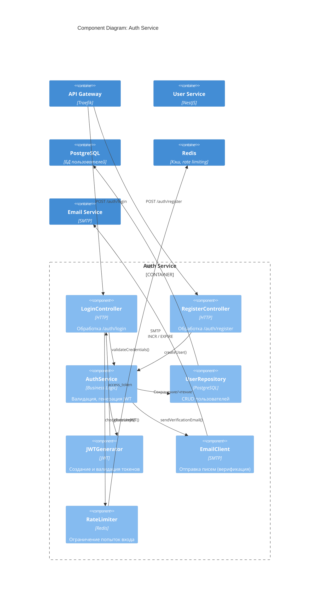

# C4 Model: Component Diagram — Auth Service

## Описание
Детализация внутренних компонентов `auth-service`.

## Компоненты
| Компонент | Ответственность |
|---------|-----------------|
| `LoginController` | HTTP-интерфейс для входа |
| `RegisterController` | HTTP-интерфейс для регистрации |
| `AuthService` | Бизнес-логика: валидация, хеширование пароля |
| `UserRepository` | Работа с БД |
| `JWTGenerator` | Подпись и валидация токенов |
| `EmailClient` | Отправка писем (верификация) |
| `RateLimiter` | Защита от брутфорса |

## Цель
- Показать, как реализуется безопасность и масштабируемость
- Поддержать стандарты из `secure-arch-guidelines.md`
- Готовность к интеграции с `user-service` и `plugin-hub`