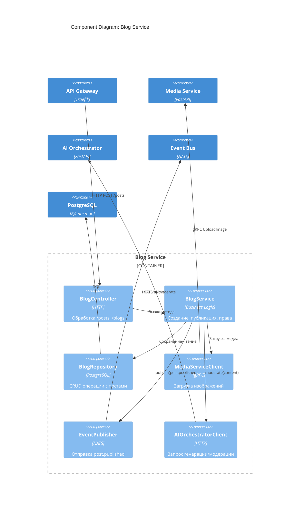

# C4 Model: Component Diagram — Blog Service

## Описание
Детализация внутренних компонентов `blog-service`.

## Компоненты

| Компонент					| Ответственность 								|
|---------------------------|-----------------------------------------------|
| `BlogController` 			| Обработка HTTP-запросов `/posts`, `/blogs` 	|
| `BlogService` 			| Бизнес-логика: создание, публикация, права 	|
| `BlogRepository` 			| Работа с PostgreSQL							|
| `MediaServiceClient` 		| Вызов `media-service` через gRPC 				|
| `EventPublisher` 			| Отправка `post.published` в NATS 				|
| `AIOrchestratorClient` 	| Запрос генерации/модерации у ИИ 				|

## Диаграмма (текстовая)
[Web App] → [API Gateway] → [BlogController]
                             ↓
                     [BlogService]
                         ↓     ↓
            [BlogRepository]   [MediaServiceClient]
                         ↓     ↓
                     [EventPublisher] → NATS
                         ↓
             [AIOrchestratorClient] → ai-orchestrator

## Цель
- Поддержка гибридного режима (блог + соцсеть)
- Интеграция с ИИ и медиа
- Готовность к поиску и уведомлениям