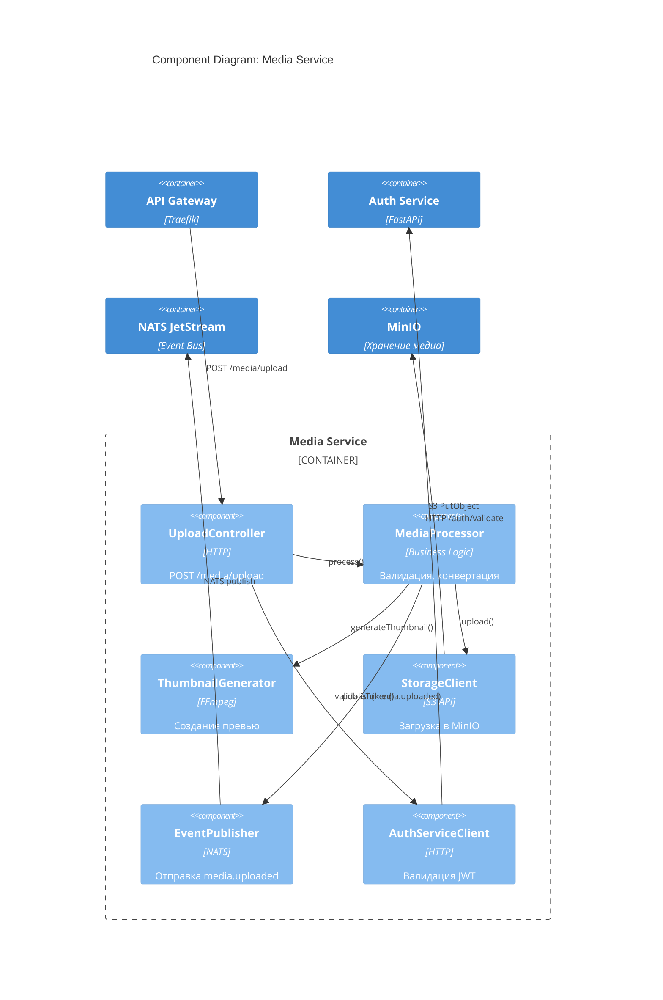

# C4 Model: Component Diagram — Media Service

## Описание
Детализация внутренних компонентов `media-service`.

## Компоненты
| Компонент | Ответственность |
|---------|-----------------|
| `UploadController` | Приём файлов |
| `MediaProcessor` | Валидация, обработка |
| `ThumbnailGenerator` | Создание превью |
| `StorageClient` | Загрузка в MinIO |
| `EventPublisher` | Публикация событий |
| `AuthServiceClient` | Проверка JWT |

## Цель
- Безопасная загрузка медиа
- Поддержка больших файлов
- Интеграция с `blog-service` и `ai-orchestrator`