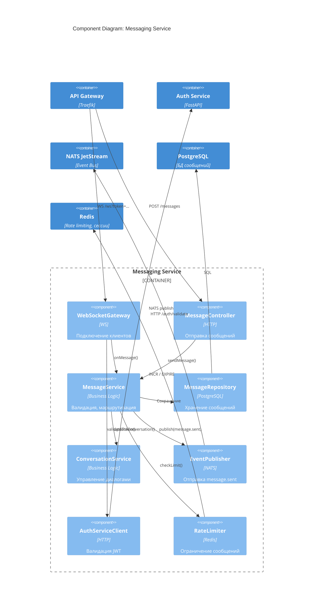

# C4 Model: Component Diagram — Messaging Service

## Описание
Детализация внутренних компонентов `messaging-service`.

## Компоненты
| Компонент | Ответственность |
|---------|-----------------|
| `WebSocketGateway` | Подключение клиентов |
| `MessageController` | HTTP-отправка |
| `MessageService` | Логика отправки |
| `MessageRepository` | Хранение сообщений |
| `ConversationService` | Управление диалогами |
| `EventPublisher` | Публикация событий |
| `AuthServiceClient` | Проверка JWT |
| `RateLimiter` | Ограничение сообщений |

## Цель
- Поддержка E2E-шифрования (в будущем)
- Высокая производительность при нагрузке
- Готовность к голосовым звонкам