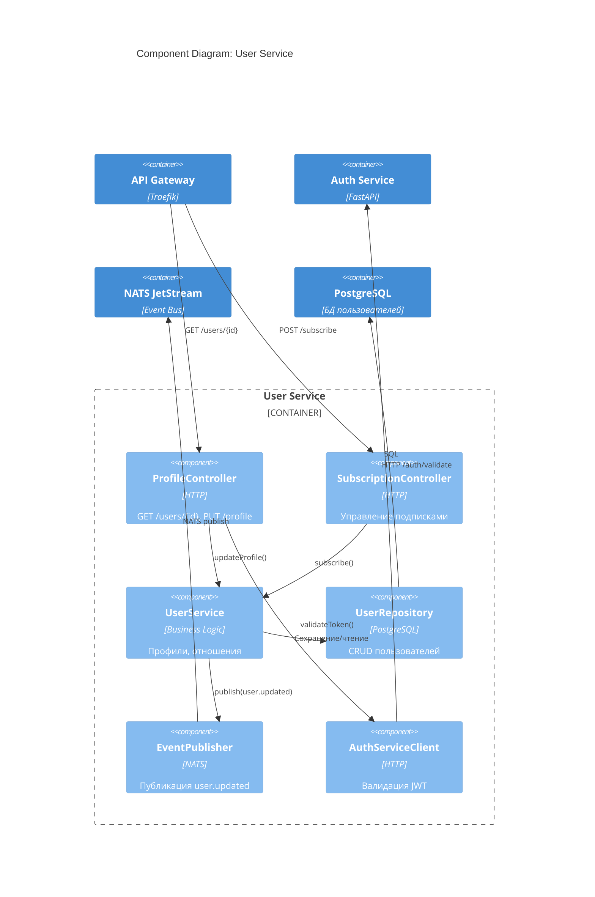

# C4 Model: Component Diagram — User Service

## Описание
Детализация внутренних компонентов `user-service`.

## Компоненты
| Компонент | Ответственность |
|---------|-----------------|
| `ProfileController` | Управление профилем |
| `SubscriptionController` | Подписки между пользователями |
| `UserService` | Бизнес-логика (друзья, подписки) |
| `UserRepository` | Работа с БД |
| `EventPublisher` | Публикация событий |
| `AuthServiceClient` | Проверка JWT |

## Цель
- Поддержка социальных функций (подписки)
- Интеграция с `auth-service` и `nats`
- Готовность к мультисайтовости