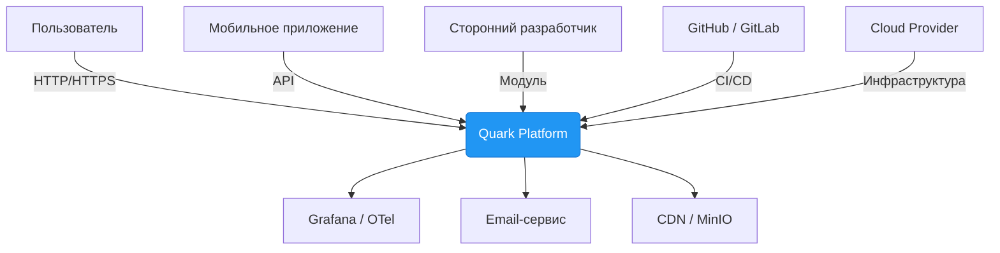

# DFD-0: Context Diagram (Level 0)

## Описание
Показывает взаимодействие системы **Quark** с внешними сущностями.

## Участники
- **Пользователь** — создаёт посты, читает, общается
- **Мобильное приложение** — клиент для Android/iOS
- **Сторонний разработчик** — загружает модули
- **GitHub / GitLab** — доставка кода
- **Cloud Provider** — хостинг (AWS/GCP)
- **Grafana / OTel** — сбор метрик
- **Email-сервис** — уведомления
- **CDN / MinIO** — хранение медиа

## Потоки данных
| От | Кому | Данные | Протокол |
|----|------|--------|---------|
| Пользователь | Quark | Логин, пост, сообщение | HTTPS |
| Quark | Пользователь | Лента, профиль, ответ | HTTPS |
| GitHub | Quark | Docker-образ | CI/CD |
| Quark | Grafana | Метрики, трейсы | OTLP |
| Quark | Email | Уведомления | SMTP |
| Quark | CDN | Изображения | S3 API |
