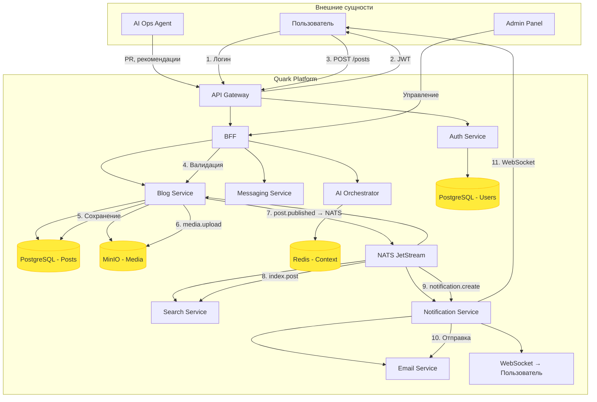

# DFD-1: Core Processes (Level 1)

## Описание
Детализирует внутренние процессы системы при ключевых сценариях.

## Ключевой сценарий: Публикация поста
1. Пользователь отправляет пост
2. BFF валидирует и передаёт `blog-service`
3. Блог-сервис:
   - Сохраняет текст в PostgreSQL
   - Загружает изображение в MinIO
   - Генерирует событие `post.published`
4. Событие рассылается:
   - `search-service` — индексирует
   - `notification-service` — отправляет уведомления
   - `ai-orchestrator` — может сгенерировать рекомендации

## Потоки данных
| Процесс | Данные | Направление |
|--------|--------|------------|
| Аутентификация | JWT | Пользователь ↔ Auth Service |
| Публикация поста | PostCreate DTO | BFF → Blog Service |
| Хранение медиа | Binary data | Blog → MinIO |
| Событие | post.published | Blog → NATS |
| Индексация | Post ID + text | NATS → Search Service |
| Уведомление | notification DTO | NATS → Notification Service |
| Отправка email | Тема, текст | Notification → Email Service |
| WebSocket | message.sent | Messaging → Пользователь |