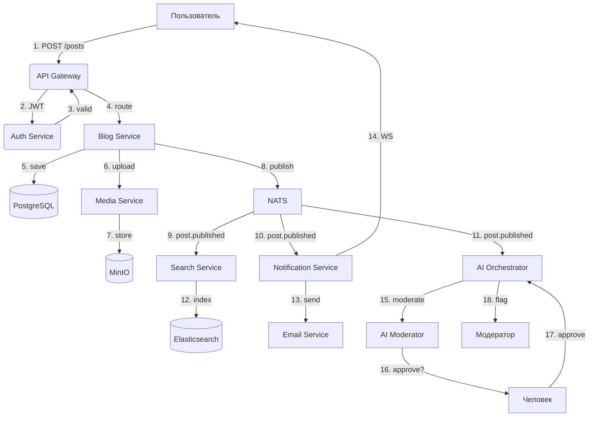

```mermaid
graph TD
    A[Пользователь] -->|1. POST /posts| B(API Gateway)
    B -->|2. JWT| C(Auth Service)
    C -->|3. valid| B
    B -->|4. route| D[Blog Service]
    D -->|5. save| E[(PostgreSQL)]
    D -->|6. upload| F[Media Service]
    F -->|7. store| G[(MinIO)]
    D -->|8. publish| H[NATS]
    H -->|9. post.published| I[Search Service]
    H -->|10. post.published| J[Notification Service]
    H -->|11. post.published| K[AI Orchestrator]
    I -->|12. index| L[(Elasticsearch)]
    J -->|13. send| M[Email Service]
    J -->|14. WS| A
    K -->|15. moderate| N[AI Moderator]
    N -->|16. approve?| O[Человек]
    O -->|17. approve| K
    K -->|18. flag| P[Модератор]
```
