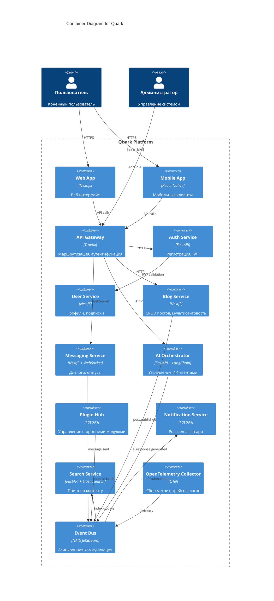

# C4 Model: Container Diagram (Level 2)

## Описание
Показывает **основные контейнеры (сервисы)** внутри системы Quark и их взаимодействие.

## Контейнеры
Каждый контейнер — это **автономный сервис** с собственной технологией и ответственностью.

## Взаимодействие
- Все запросы идут через **API Gateway**
- Сервисы общаются через **Event Bus (NATS)**
- **OpenTelemetry** собирает данные со всех сервисов

## Цель
- Показать внутреннюю структуру системы
- Обозначить границы сервисов
- Подготовить почву для Component Diagrams