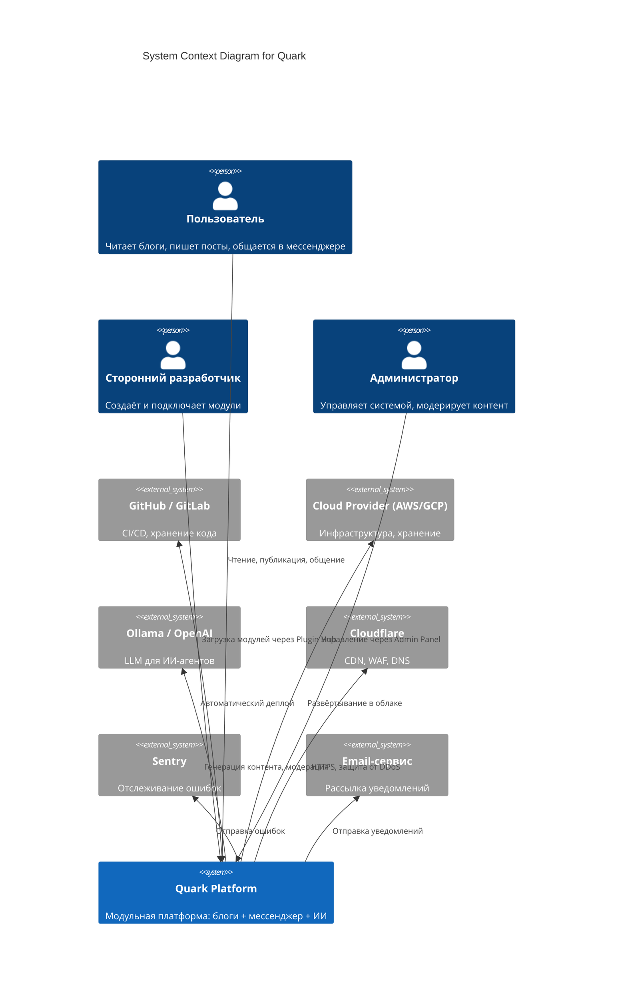

# C4 Model: System Context (Level 1)

## Описание
Показывает систему **Quark** в её окружении: пользователи, внешние сервисы, зависимости.

## Участники
- **Пользователь** — основной потребитель платформы
- **Сторонний разработчик** — создаёт модули
- **Администратор** — управляет системой
- **Внешние сервисы** — интеграции

## Цель
- Показать границы системы
- Определить взаимодействие с внешним миром
- Использовать как основу для более детальных диаграмм