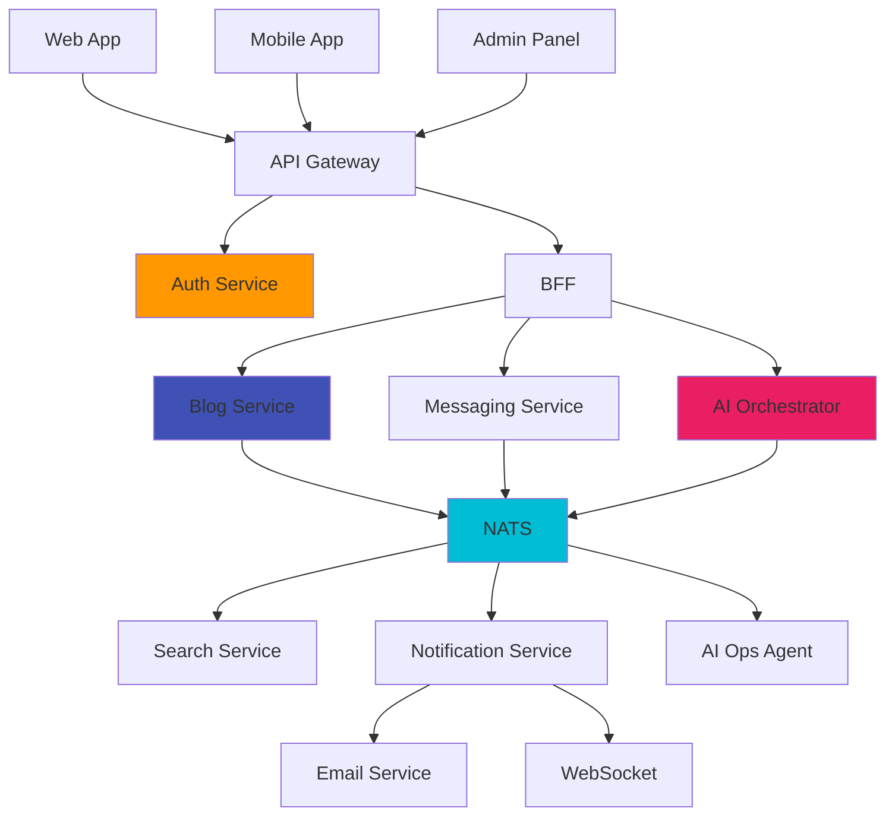

# Service Map: Зависимости сервисов

## Описание
Визуализация взаимодействия между сервисами.

## Типы зависимостей
| Тип | Пример |
|-----|-------|
| HTTP | BFF → Blog Service |
| WebSocket | Messaging → Пользователь |
| NATS | Blog → Search |
| gRPC | AI Orchestrator → AI Writer |