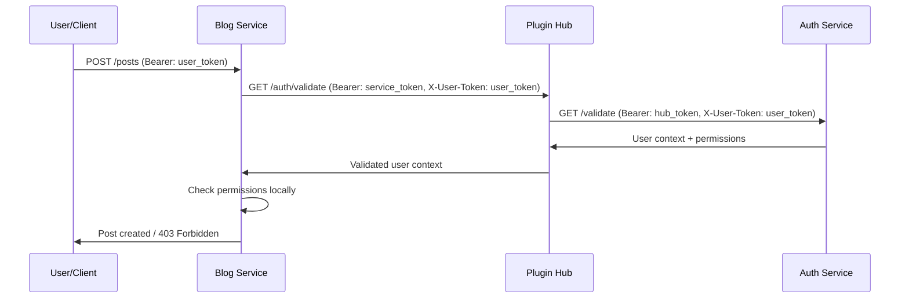

# Межмодульная аутентификация и авторизация в МКС

## Архитектурное решение (на основе ADR-005, ADR-006 и security/iam.md)

### 1. Трехуровневая система токенов

#### 1.1 User Tokens (Клиентские токены)
```json
{
  "sub": "user-123abc",
  "roles": ["user", "moderator"],
  "permissions": ["posts:read", "posts:write:own", "users:moderate"],
  "exp": 1712349278,
  "iss": "quark-auth-service",
  "aud": ["blog-service", "messaging-service"]
}
```

#### 1.2 Service Tokens (Межсервисные токены)
```json
{
  "sub": "service:blog-service",
  "service_id": "blog-service",
  "roles": ["service"],
  "permissions": ["auth:validate", "users:read:basic"],
  "exp": 1712352878,
  "iss": "quark-plugin-hub",
  "aud": ["auth-service", "user-service"]
}
```

#### 1.3 Hub Tokens (Системные токены)
```json
{
  "sub": "system:plugin-hub",
  "service_id": "plugin-hub",
  "roles": ["system", "hub"],
  "permissions": ["*"],
  "exp": 1712356478,
  "iss": "quark-plugin-hub",
  "aud": ["*"]
}
```

### 2. Поток аутентификации пользователя



### 3. Реализация в Plugin Hub (Identity Provider)

```typescript
// Добавляем в Plugin Hub роль Identity Provider
class PluginHubIdentityProvider {
  private jwtSecret: string;
  private serviceTokens: Map<string, string> = new Map();

  // Выдача service tokens при регистрации модуля
  async issueServiceToken(moduleId: string, permissions: string[]): Promise<string> {
    const payload = {
      sub: `service:${moduleId}`,
      service_id: moduleId,
      roles: ['service'],
      permissions,
      exp: Math.floor(Date.now() / 1000) + 3600, // 1 час
      iss: 'quark-plugin-hub',
      aud: ['auth-service', 'user-service']
    };
    
    const token = jwt.sign(payload, this.jwtSecret);
    this.serviceTokens.set(moduleId, token);
    return token;
  }

  // Централизованная валидация user tokens
  async validateUserToken(userToken: string, requesterServiceId: string): Promise<UserContext | null> {
    try {
      // Проверяем service token запрашивающего модуля
      const serviceToken = this.serviceTokens.get(requesterServiceId);
      if (!serviceToken || !this.validateServiceToken(serviceToken)) {
        throw new Error('Invalid service token');
      }

      // Делаем запрос к Auth Service для валидации user token
      const response = await axios.post('http://auth-service:3001/auth/validate', {
        token: userToken
      }, {
        headers: {
          'Authorization': `Bearer ${await this.getHubToken()}`,
          'X-Service-ID': 'plugin-hub'
        }
      });

      return response.data; // { user_id, roles, permissions, profile }
    } catch (error) {
      console.error('User token validation failed:', error);
      return null;
    }
  }

  // Получение контекста пользователя для модуля
  async getUserContext(userToken: string, serviceId: string): Promise<UserContext> {
    const userContext = await this.validateUserToken(userToken, serviceId);
    if (!userContext) {
      throw new Error('Invalid user token');
    }

    // Кэшируем в Redis на 5 минут
    await this.redis.setex(
      `user_context:${userToken}:${serviceId}`, 
      300, 
      JSON.stringify(userContext)
    );

    return userContext;
  }
}
```

### 4. Auth Middleware для модулей

```typescript
// Универсальный middleware для всех модулей
export function createQuarkAuthMiddleware(quarkModule: QuarkModule) {
  return async (req: any, res: any, next: any) => {
    try {
      const userToken = req.headers.authorization?.replace('Bearer ', '');
      if (!userToken) {
        return res.status(401).json({ error: 'Missing authorization token' });
      }

      // Проверяем кэш
      const cached = await quarkModule.getFromCache(`user_context:${userToken}`);
      if (cached) {
        req.user = JSON.parse(cached);
        return next();
      }

      // Запрашиваем контекст у Plugin Hub
      const userContext = await quarkModule.getUserContext(userToken);
      
      // Добавляем в request
      req.user = userContext;
      
      // Кэшируем локально на 2 минуты
      await quarkModule.setCache(`user_context:${userToken}`, JSON.stringify(userContext), 120);
      
      next();
    } catch (error) {
      res.status(401).json({ error: 'Invalid token', details: error.message });
    }
  };
}

// Использование в модуле
const authMiddleware = createQuarkAuthMiddleware(quarkModule);
app.use('/api/protected', authMiddleware);
```

### 5. Пример: Создание поста в Blog Service

```typescript
// Blog Service - создание поста
app.post('/api/posts', authMiddleware, async (req, res) => {
  try {
    const { user } = req; // Получен из middleware
    
    // Проверяем права локально
    if (!user.permissions.includes('posts:write:own')) {
      return res.status(403).json({ error: 'Insufficient permissions' });
    }

    // Создаем пост
    const post = await createPost({
      title: req.body.title,
      content: req.body.content,
      author_id: user.user_id,
      author_name: user.username
    });

    // Публикуем событие
    await quarkModule.publishEvent({
      type: 'post.created',
      data: {
        post_id: post.id,
        author_id: user.user_id,
        title: post.title
      }
    });

    res.json(post);
  } catch (error) {
    res.status(500).json({ error: error.message });
  }
});
```

### 6. Система разрешений (RBAC)

```typescript
interface UserContext {
  user_id: string;
  username: string;
  email: string;
  roles: string[];
  permissions: string[];
  profile: {
    display_name: string;
    avatar_url?: string;
    verified: boolean;
  };
  session: {
    created_at: string;
    expires_at: string;
    ip_address: string;
  };
}

// Права по ролям (определены в Auth Service)
const ROLE_PERMISSIONS = {
  'user': [
    'posts:read',
    'posts:write:own',
    'comments:write',
    'profile:read:own',
    'profile:write:own'
  ],
  'moderator': [
    'posts:read',
    'posts:write:any',
    'posts:moderate',
    'comments:moderate',
    'users:read:basic'
  ],
  'admin': ['*'] // Все права
};
```

### 7. Защита gRPC взаимодействий

```typescript
// gRPC interceptor для аутентификации
class AuthInterceptor {
  async authenticate(call: any, callback: any) {
    try {
      const metadata = call.metadata;
      const serviceToken = metadata.get('authorization')[0]?.replace('Bearer ', '');
      const serviceId = metadata.get('x-service-id')[0];

      if (!await this.validateServiceToken(serviceToken, serviceId)) {
        return callback(new Error('Unauthorized service call'));
      }

      callback();
    } catch (error) {
      callback(error);
    }
  }
}

// Использование в gRPC сервисе
const server = new grpc.Server();
server.addService(AIWriterService, new AIWriterImplementation());
server.use(new AuthInterceptor());
```

### 8. События аутентификации

```typescript
// Публикуемые события для синхронизации
interface AuthEvent {
  // Пользователь вошел в систему
  'user.logged_in': {
    user_id: string;
    session_id: string;
    ip_address: string;
    user_agent: string;
  };
  
  // Пользователь вышел
  'user.logged_out': {
    user_id: string;
    session_id: string;
  };
  
  // Роли изменены
  'user.roles_changed': {
    user_id: string;
    old_roles: string[];
    new_roles: string[];
  };
  
  // Токен отозван
  'token.revoked': {
    token_id: string;
    user_id: string;
    reason: string;
  };
}
```

### 9. Кэширование и производительность

```typescript
// Трехуровневое кэширование
class AuthCacheManager {
  // L1: Локальный кэш модуля (in-memory, 2 мин)
  private localCache = new Map();
  
  // L2: Redis кэш Plugin Hub (5 мин)
  private redisCache: Redis;
  
  // L3: Авторитетный источник - Auth Service
  
  async getUserContext(token: string): Promise<UserContext> {
    // L1 check
    if (this.localCache.has(token)) {
      return this.localCache.get(token);
    }
    
    // L2 check
    const cached = await this.redisCache.get(`user:${token}`);
    if (cached) {
      const context = JSON.parse(cached);
      this.localCache.set(token, context);
      return context;
    }
    
    // L3 - запрос к Auth Service
    const context = await this.fetchFromAuthService(token);
    
    // Кэшируем на всех уровнях
    this.localCache.set(token, context);
    await this.redisCache.setex(`user:${token}`, 300, JSON.stringify(context));
    
    return context;
  }
}
```

## Преимущества решения

1. **Централизованная аутентификация** - Plugin Hub как единая точка доверия
2. **Кэширование** - минимизация запросов к Auth Service
3. **Безопасность** - трехуровневые токены с разными правами
4. **Производительность** - локальный кэш + Redis
5. **Масштабируемость** - горизонтальное масштабирование Auth Service
6. **Совместимость** - работает с существующей архитектурой (ADR-005, ADR-006)

Это решение полностью соответствует уже принятым архитектурным решениям и обеспечивает безопасную передачу пользовательского контекста между модулями МКС.
